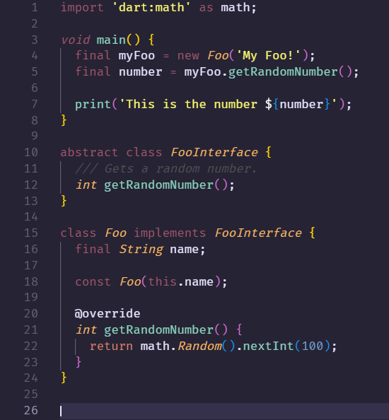

# VsCodeTheme

This is my daily vscode theme written in order to use with dart and flutter. 
However it may work fine with other languages.

## Example

Here are some images of the theme.

Some dart code and editor images as example:  

## How to install

1. You can download a [VSIX Release](releases/) file and install it through the extensions panel. 
Press the options button ("...") and click "Install from VSIX".

2. You can also check the [Marketplace](https://marketplace.visualstudio.com/items?itemName=ExBrain.nighty-purple) for this extension

